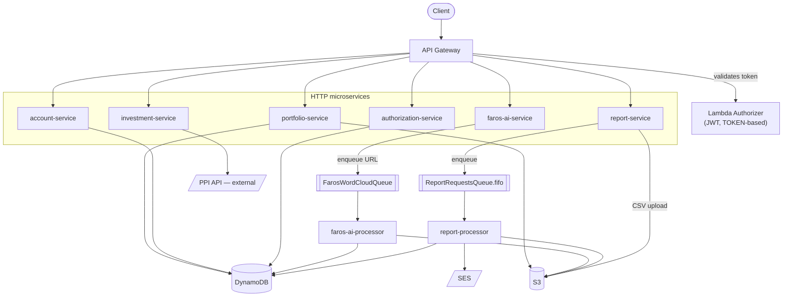

# Project Personal Services

A serverless backend built with **Clean Architecture** and **Domain-Driven Design** principles — 7 independently deployable microservices (HTTP and async) sharing one AWS stack, one Serverless Framework deployment, and one set of architectural conventions.

Built and maintained by [Federico Irarrázaval](https://github.com/FedeIra).

---

## Stack

| | |
|---|---|
| **Runtime** | Node.js 20.x + TypeScript 5.7.3 |
| **Framework** | Serverless Framework 4.x |
| **HTTP** | Fastify 5.x + `@fastify/aws-lambda` |
| **Compute** | AWS Lambda |
| **Data** | DynamoDB, S3 |
| **Messaging** | SQS (FIFO + Standard), SES |
| **Auth** | JWT (HS256) via a Lambda TOKEN authorizer |
| **Deploy** | `us-east-2`, stage `dev` |

## Architecture

Clean Architecture layering is enforced in every microservice: **Domain → Application → Infrastructure**, wired together with manual dependency injection at the entry point (`app.ts` / `handler.ts`). Domain code has no external dependencies; Application only depends on interfaces; Infrastructure implements those interfaces against DynamoDB, S3, SQS, and HTTP.



Two details worth calling out for anyone reading the `serverless.yml`:

- **Partial batch failure handling on SQS → Lambda.** Both async processors (`report-request-processor`, `faros-ai-processor`) declare `functionResponseType: ReportBatchItemFailures` on their event source mapping. Each handler reports failed message IDs individually instead of failing the whole batch, so a single bad record is retried (up to `maxReceiveCount`, then routed to its DLQ) without reprocessing messages that already succeeded.
- **Least-privilege IAM.** The Lambda execution role's DynamoDB statement is scoped to explicit table ARNs (`table/UserCredentials`, `table/Accounts`, `table/ReportRequests`, …) built from `AWS::Region` / `AWS::AccountId`, not `Resource: '*'`. Same pattern for S3 (bucket-scoped) and SSM (path-scoped under `/fedeira-personal-services/*`).

## Services

| Service | Type | Responsibility |
|---|---|---|
| [`authorization-services`](authorization-services) | HTTP | JWT login (`POST /login`) + Lambda authorizer for token validation |
| [`account-services`](account-services) | HTTP | Paginated account listing, AES-256-CBC encryption at rest |
| [`investment-services`](investment-services) | HTTP | Integrates with the Portfolio Personal Inversiones (PPI) API — OAuth2 token caching, retry with backoff |
| [`report-services`](report-services) | HTTP + async | CSV upload → S3 + DynamoDB → SQS FIFO, decoupling upload from processing |
| [`report-processor`](report-processor) | Async (SQS) | Consumes `report-services`' queue, calculates labor termination liquidations, emails the result via SES |
| [`portfolio-services`](portfolio-services) | HTTP | Portfolio comments, contact email (SES), and file management (S3) |
| [`faros-ai-services`](faros-ai-services) | HTTP + async | Amazon product-page crawler that builds a word cloud of the most significant terms — see [detailed docs](faros-ai-services/documentation/README-faros-ai.md) |
| [`common`](common) | Shared | `ResponseBuilder`, `ErrorHandler`, retry-configured Axios client |

Full API reference, request/response payloads, and the Postman collection live in **[`common/docs/README.md`](common/docs/README.md)**.

## Getting Started

Prerequisites: Node.js 20.x, Docker (for local DynamoDB), AWS CLI, Serverless Framework.

```bash
git clone https://github.com/FedeIra/Project-Personal-Services.git
cd Project-Personal-Services
npm install

cp env.example .env   # fill in real values

npm run offline-db-init      # local DynamoDB via Docker
npm run offline-db-migrate   # create tables
npm run insert-user          # seed a test user
npm run insert-accounts      # seed test accounts

npm run offline               # API at http://localhost:3000
```

See [`common/docs/README.md`](common/docs/README.md) for the full local setup, deployment, and environment variable reference.

## Useful Commands

| Command | Description |
|---|---|
| `npm run offline` | Run the API locally with Serverless Offline |
| `npm run typecheck` | TypeScript type-check (no emit) |
| `npm run lint` | ESLint |
| `npm run predeploy` | build + typecheck + lint |
| `npm run deploy` | Deploy to AWS (stage `dev`) |

## Documentation

- [`common/docs/README.md`](common/docs/README.md) — full API reference, local setup, deployment
- [`common/docs/architecture.png`](common/docs/architecture.png) / [`.drawio`](common/docs/architecture.drawio) — editable architecture diagram
- [`faros-ai-services/documentation/README-faros-ai.md`](faros-ai-services/documentation/README-faros-ai.md) — Faros AI Word Cloud service deep dive
- Postman collection: [`common/docs/Project Personal Services API.postman_collection.json`](<common/docs/Project Personal Services API.postman_collection.json>)
